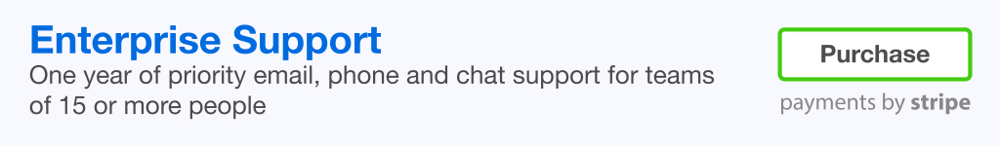

[](https://freshbits.io)
[](https://travis-ci.org/mmnaseri/spring-data-mock)
[](https://www.codacy.com/app/mmnaseri/spring-data-mock)
[](https://coveralls.io/github/mmnaseri/spring-data-mock?branch=master)

# Spring Data Mock

**A lightning fast framework for mocking Spring Data repositories.**

Spring Data provides a great foundation for separating data from business
concerns. However, when you want to test your application, it forces you to
either write lots of boilerplate code or start a full blown application context
and backing database. This wastes expensive developer time, makes test execution
significantly slower, and is completely unnecessary.

**Spring Data Mock will save you time and money, while making your tests run faster.**

Reduce the amount of code you need to write, while using a reliable
infrastructure that replicates what Spring would do with an actual database,
only in-memory.


## Commercial Support

**Kick start a new project or boost your existing team's productivity.**
We'll show you how to save LOTS of developer time. We provide dedicated phone,
email and chat support to get you going. Purchase Enterprise Support for teams
of 15 or more people, or Developer Support for smaller teams.

<p>
  <a href="https://mmnaseri.github.io/spring-data-mock">
    
  </a>
</p>
<p>
  <a href="https://mmnaseri.github.io/spring-data-mock">
    
  </a>
</p>

Some quick facts:

* more than 1000 individual unit tests
* 100% [code coverage](https://coveralls.io/github/mmnaseri/spring-data-mock)
* 95% branch coverage rate
* Covers all Spring Data Commons repository specifications, except predicates (support is planned)
* More than 6000 lines of code, of which a substantial amount is unit tests
* JavaDocs for every public class and method

Learn more about [supported open source](https://freshbits.io/supported-open-source).

## Documentation

For a complete documentation check out [the website](https://mmnaseri.github.io/spring-data-mock).

There you can get more information on how to download the framework, as well as
how you can incorporate it in your project to have hassle-free data store
mocking capabilities added to your shiny applications.

* Downloading
* Quick Start
* FAQ
* Contributions
* History


### Downloading

Spring Data Mock can be cloned directly from the GitHub repo:

    $ git clone https://github.com/mmnaseri/spring-data-mock.git

or installed from Maven central:

    <dependency>
        <groupId>com.mmnaseri.utils</groupId>
        <artifactId>spring-data-mock</artifactId>
        <version>${spring-data-mock.version}</version>
        <scope>test</scope>
    </dependency>

*Spring Data Mock* depends on [Apache Commons Logging](https://commons.apache.org/proper/commons-logging/) to log
all the interactions with the framework. If you need to, you can exclude this
dependency from the framework by using [Maven exclusions](https://maven.apache.org/guides/introduction/introduction-to-optional-and-excludes-dependencies.html#Dependency_Exclusions):

```xml
    <dependency>
        <groupId>com.mmnaseri.utils</groupId>
        <artifactId>spring-data-mock</artifactId>
        <version>${spring-data-mock.version}</version>
        <scope>test</scope>
        <exclusions>
            <exclusion>
                <groupId>commons-logging</groupId>
                <artifactId>commons-logging</artifactId>
            </exclusion>
        </exclusions>
    </dependency>
```

## Quick Start

Regardless of how you add the necessary dependency to your project, mocking a repository can be as simple as:

    final UserRepository repository = builder().mock(UserRepository.class);

where `builder()` is a static method of the `RepositoryFactoryBuilder` class under package `com.mmnaseri.utils.spring.data.dsl.factory`.

Example:

```java
import com.mmnaseri.utils.spring.data.dsl.factory.RepositoryFactoryBuilder;

public class CustomerRepositoryTest {

    @Test
    public void testDemo() {

        final CustomerRepository repository = RepositoryFactoryBuilder.builder().mock(CustomerRepository.class);
        repository.save(new Customer());
```

An alternate way of mocking a repository would be by using the `RepositoryMockBuilder` class under the `com.mmnaseri.utils.spring.data.dsl.mock`
package:

    final RepositoryFactoryConfiguration configuration = ... ;
    final UserRepository repository = new RepositoryMockBuilder().useConfiguration(configuration).mock(UserRepository.class);


  ### FAQ

  1. Why did you write this?

  > I was testing some pretty complicated services that relied on Spring Data to provide data. It was a lot of
  hassle to keep the test environment up-to-date with the test requirements as well as the real world situation.
  Also, it was pretty darn slow to run the tests, given database connection latency and all. I wanted to be able
  to isolate my services and test them regardless of the database features. To make it short, I wrote this
  framework to be able to separate integration/acceptance tests and unit tests.

  2. Why did you make this open source?

  > Because everything I use (or nearly so) in my line of work is open source. It was time I gave something back.
  Also, the people behind Spring rock. I felt like I was selling tickets to the concert of rockstars by releasing
  this.

  3. What is the main design decision behind this framework?

  > Make the developer work as little as possible.

  4. When should I use this?

  > You should only use this to write *unit* tests. For anything else, you would want the whole application to come alive and work. Using mocks for that is a bad idea.

  5. This is going to be used at the level of code testing. Is it really well written?

  > It is. According to Cobertura, it has **100% code coverage**, and according to Codacy, it has **0 code issues**.


  ### Contributions

  Since this project is aimed at the testing phase of your code, it is paramount
  that it is written with the best of qualities and that it maintains the highest
  standard.

  Contributors are more than welcome. In fact, I flag most of the issues I receive
  as `help wanted` and there are really generous people out there who do take care
  of some issues.

  If you see a piece of code that you don't like for whatever reason -- so long as
  that reason can be backed by pioneers and standards -- feel free to dig in and
  change the code to your heart's content and create a pull request.


  ### History

  - 1.1 Add QueryDSL and findByExample support

  see [site changelog](https://mmnaseri.github.io/spring-data-mock/site/#/changelog)
